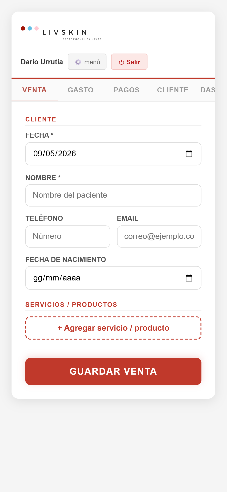
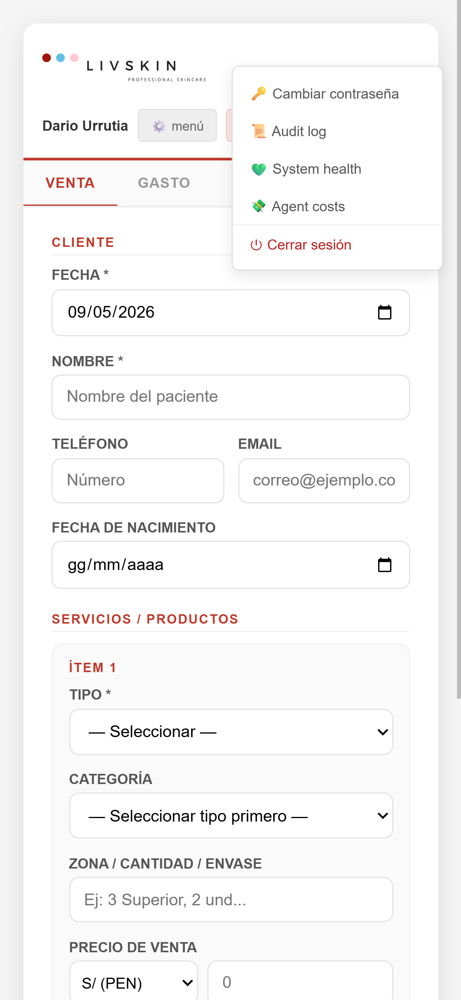
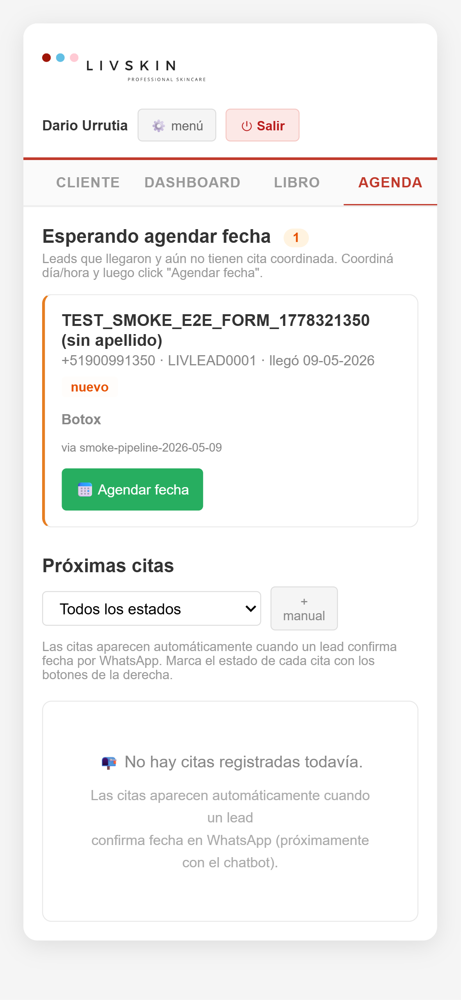
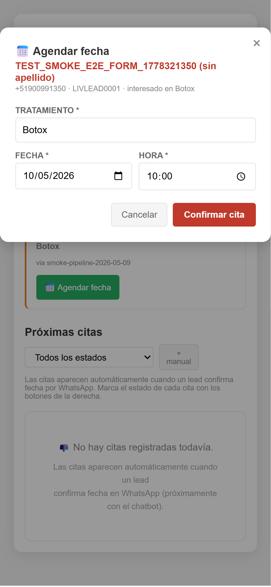
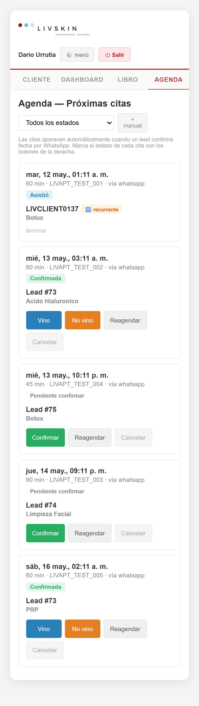
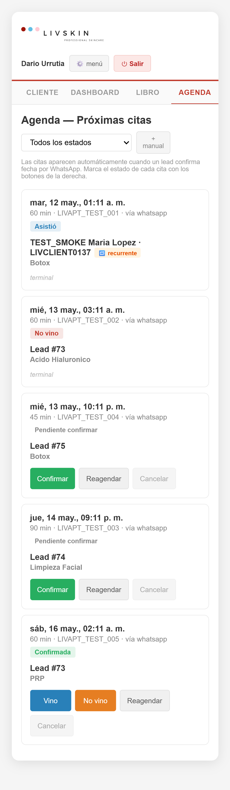
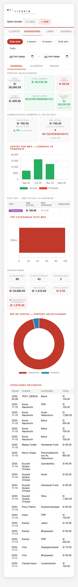
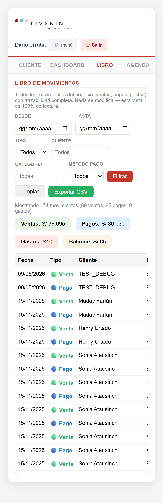
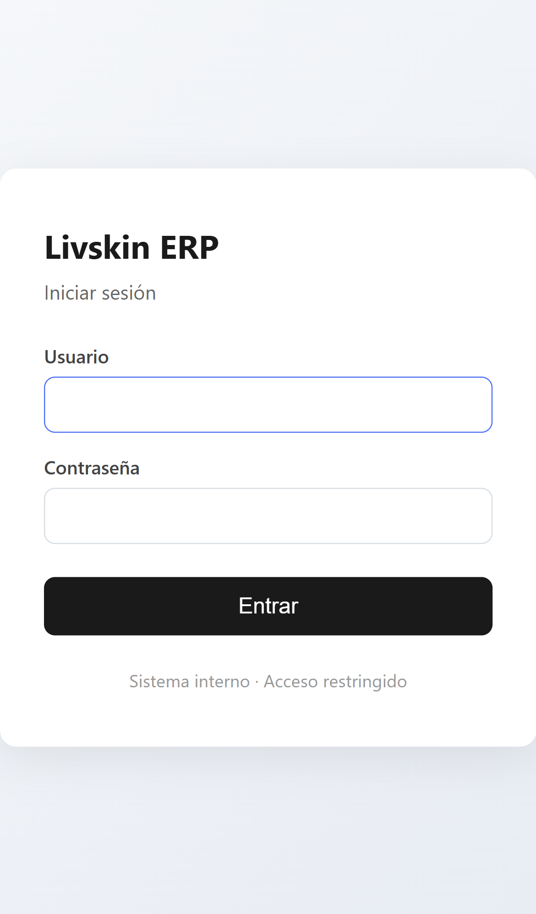

# ERP Smoke E2E — 2026-05-09

**Viewport:** iPhone 13 Pro (390×844) · headed mode

**Resultado:** 22/22 PASS

## Tests ejecutados

| # | Test | Status | Detalles |
|---|---|---|---|
| 1 | login redirect a / | ✅ | — |
| 2 | logo presente | ✅ | — |
| 3 | nombre user visible | ✅ | — |
| 4 | boton Salir prominente | ✅ | — |
| 5 | boton menu admin (⚙️) | ✅ | — |
| 6 | menu admin desplegable abre | ✅ | — |
| 7 | pestaña venta renderiza | ✅ | — |
| 8 | pestaña gasto renderiza | ✅ | — |
| 9 | pestaña pagos renderiza | ✅ | — |
| 10 | pestaña cliente renderiza | ✅ | — |
| 11 | pestaña dashboard renderiza | ✅ | — |
| 12 | pestaña libro renderiza | ✅ | — |
| 13 | pestaña agenda renderiza | ✅ | — |
| 14 | Agenda muestra cards (smoke data) | ✅ | 5 cards visibles |
| 15 | Confirmar cambia estado a Confirmada | ✅ | 3 confirmadas |
| 16 | Vino crea cliente nuevo (datalist crece tras reload) | ✅ | 134 -> 135 |
| 17 | No vino marca status no_show | ✅ | 1 en no_show |
| 18 | Cliente tab visible | ✅ | — |
| 19 | Dashboard tab visible | ✅ | — |
| 20 | Libro tab visible | ✅ | — |
| 21 | logout redirect a /login | ✅ | https://erp.livskin.site/login |
| 22 | re-login exitoso | ✅ | — |

## Screenshots

- 
- 
- 
- 
- 
- 
- 
- 
- 
