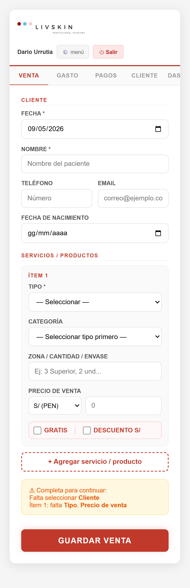
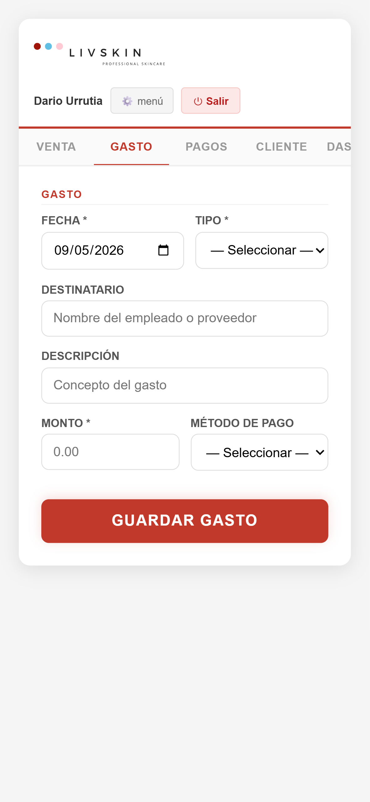
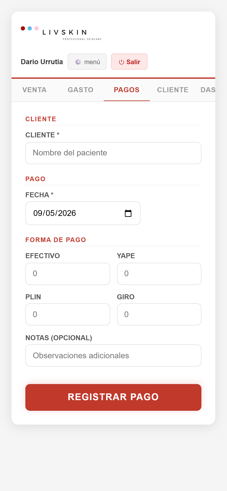
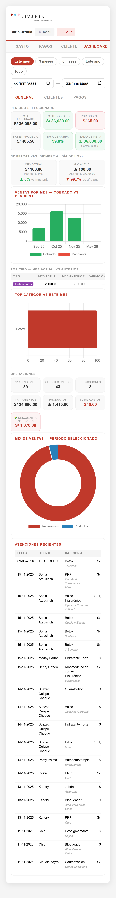
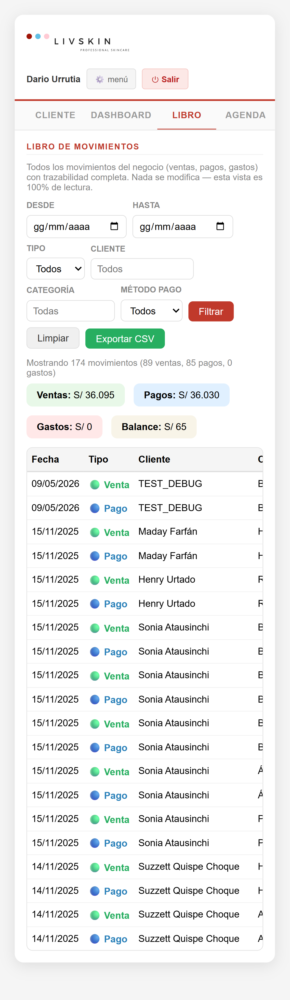
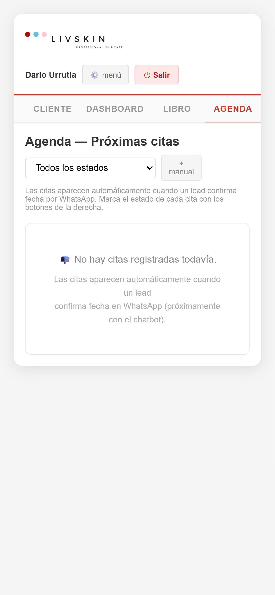

# ERP UI Audit — 2026-05-09

**Viewport:** iPhone 15 (393×852) — alineado con devices reales (iPhone 15/16 + Xiaomi 14T Pro)
**Pestañas validadas:** 7

## Findings

Sin findings — UI sana en mobile.

## Screenshots

- 
- 
- 
- 
- 
- 
- 

## Console errors por pestaña

### login
- `[error] Failed to load resource: the server responded with a status of 404 ()`
