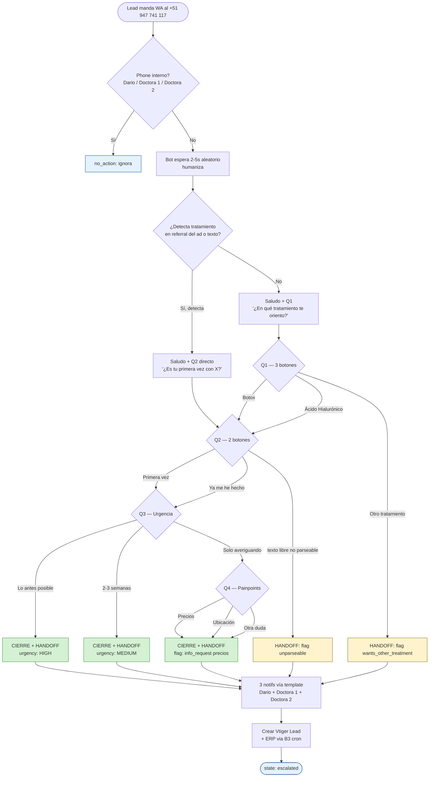
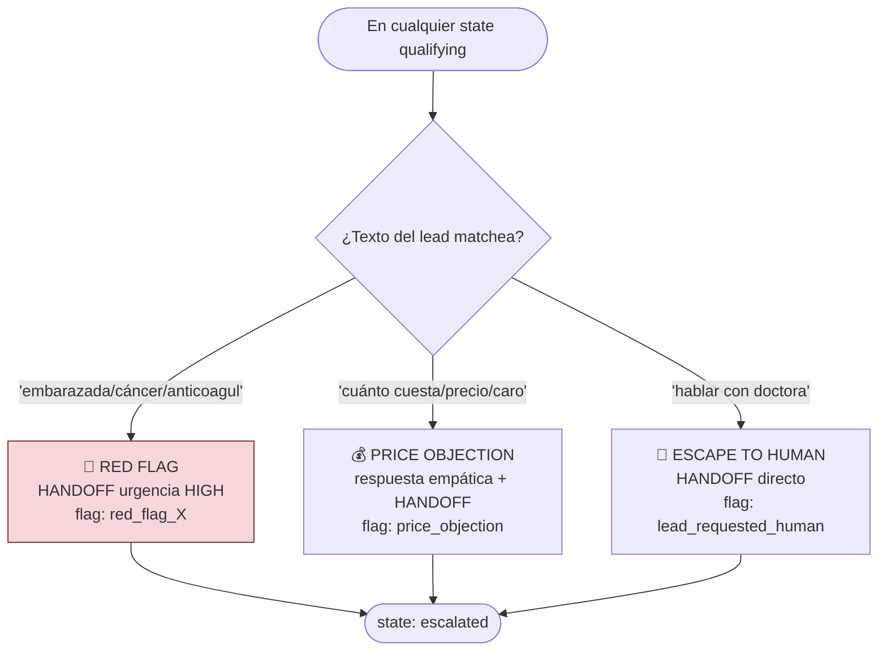
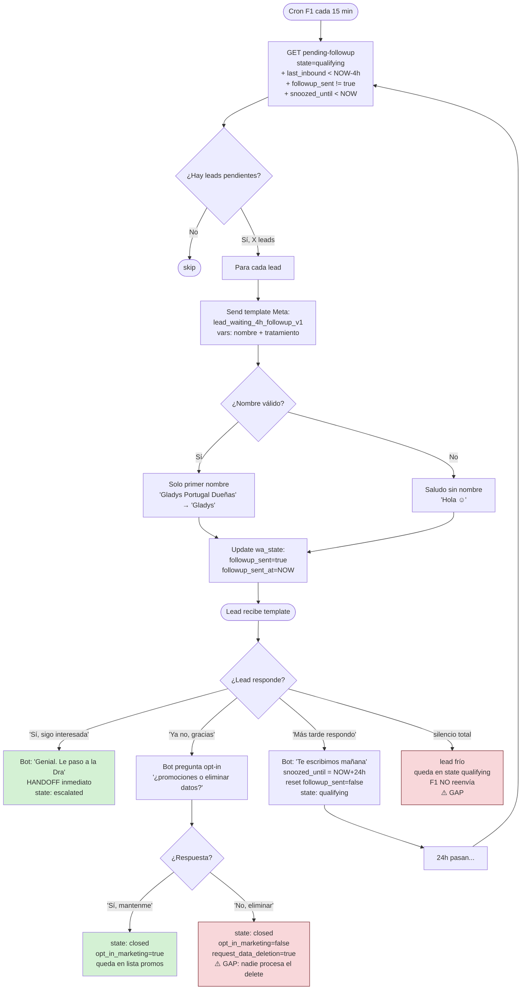
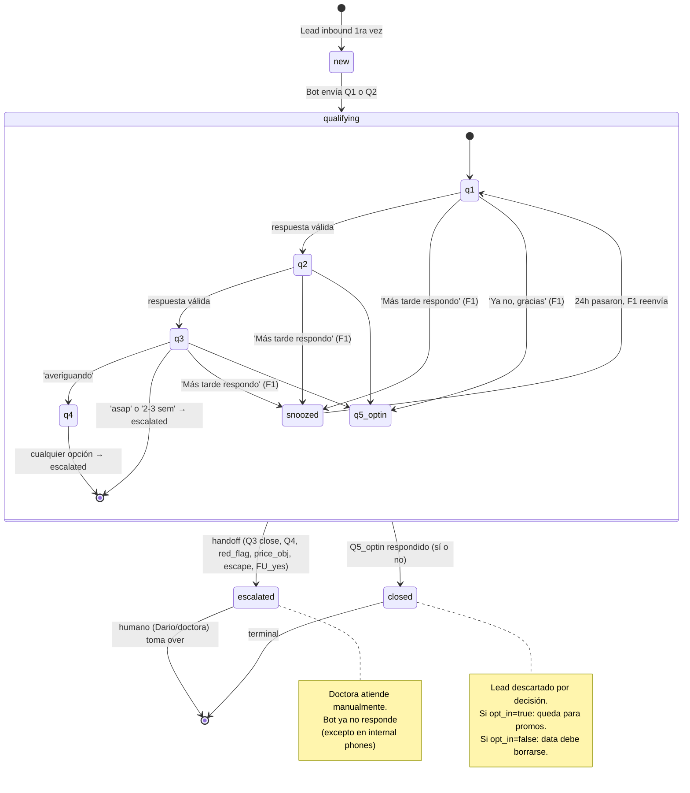

# Flow completo bot Yossie v2 + F1 follow-up

> **Cómo ver**: este archivo se ve mejor en Obsidian, VS Code (con plugin Mermaid) o GitHub.
> Los bloques ```mermaid``` se renderizan automáticamente.
> Última actualización: 2026-05-26

---

## 1. Flow conversacional — primera interacción del lead



---

## 2. Escape hatches — interrumpen el flow en cualquier momento



---

## 3. F1 — Follow-up 4h (cron cada 15 min)



---

## 4. Estados completos en `wa_conversation_state`



---

## 5. ⚠️ GAPS IDENTIFICADOS (sin resolver — control que necesitas)

### A. Lead que NO responde NUNCA (ni al primer mensaje ni al follow-up)
**Estado actual**: queda en `qualifying` con `followup_sent=true`. F1 NO reenvía. Nadie hace nada. Lead "muere" en silencio.

**Propuesta de fix**:
- Tras 48h-72h sin respuesta post-followup → marcar `state=closed_cold` automáticamente
- Workflow F2: cron diario que detecta `qualifying` + `followup_sent=true` + silencio > 72h → cierra como `closed_cold`
- Opcional: 2do follow-up suave a las 72h (template MARKETING aprobado: `reengagement_inactive_30d_v1` modificado)

### B. Lead pide "No, eliminar mis datos" — NADIE elimina realmente
**Estado actual**: bot pone `request_data_deletion=true` en context_json. Pero NO existe workflow que procese esa bandera y haga DELETE cross-system.

**Propuesta de fix**:
- Workflow F3 (cron diario): GET leads con `request_data_deletion=true AND state=closed`
- Para cada uno:
  - Delete `wa_messages WHERE phone_lead=X`
  - Delete `wa_conversation_state WHERE phone_lead=X`
  - Delete lead Vtiger asociado (cascade)
  - Delete `leads` ERP asociado
  - Audit log: `system.gdpr_data_deletion` (preservar el registro de que se borró, sin PII)

### C. Lead manda emoji / sticker / imagen / audio en lugar de texto
**Estado actual**: bot detecta `type` (text, button, interactive, image, audio, document, location) pero solo PROCESA `text` y `button`. Si manda imagen/audio/sticker, bot lo trata como texto vacío → cae en `handoff_unparseable`.

**Propuesta de fix**:
- Si type=image → bot responde "Recibí tu imagen. Le paso a la Dra. para que la revise ☺️" + handoff con flag `lead_sent_image`
- Si type=audio → ídem con flag `lead_sent_audio`
- Si type=sticker → ignorar (no responder, common WA quirk)

### D. Lead responde con texto libre POST-cierre (state=escalated)
**Estado actual**: bot retorna `no_action` (correcto — humano takes over). Pero ¿la doctora se entera del mensaje?

**Propuesta de fix**:
- Verificar: ¿la doctora recibe automáticamente el mensaje del lead post-escalado vía Meta? Sí, porque su WA está conectado al número Livskin (24h window abierta).
- Si NO → agregar fallback que reenvíe a doctora un mensaje "el lead te escribió X"

### E. Bot envió template follow-up pero Meta lo rechazó (failed)
**Estado actual**: F1 marca `followup_sent=true` aunque Meta NO entregue (ej. número inválido, bloqueo de usuario).

**Propuesta de fix**:
- F1 verifica el status callback de Meta antes de marcar followup_sent
- Si Meta devuelve `failed` → log error + NO marcar followup_sent → permitir retry en próximo ciclo

### F. Conversación queda atorada en `qualifying:q5_optin` sin respuesta
**Estado actual**: si lead recibe pregunta opt-in pero no responde, queda en limbo. No hay follow-up para Q5.

**Propuesta de fix**:
- Default tras 7 días sin respuesta a Q5: asumir `opt_in_marketing=false` + cerrar (privacy-default-deny)

### G. Race condition: lead manda 2 mensajes seguidos
**Estado actual**: si lead manda "Hola" y 5 segundos después "vi su anuncio botox" — Meta dispara 2 webhooks. Bot procesa ambos pero el segundo lee state que el primero acaba de actualizar. Posible inconsistencia.

**Propuesta de fix**:
- Lock optimista en wa_conversation_state (campo `version` o `updated_at` con WHERE en UPDATE)
- O cola serializada en n8n (pero complica arquitectura)
- O acceptar que es un edge case raro (<1% probable) y dejar

### H. Doctora responde al lead DESDE su WhatsApp personal (no desde el número Livskin)
**Estado actual**: la doctora ve la notif del bot Yossie + tiene número Livskin asociado vía 24h window. Pero si responde al lead DESDE su número personal (+51 910 848 995), el lead recibe mensaje desde un número desconocido — confusión.

**Propuesta de fix**:
- La doctora DEBE responder desde el número Livskin (+51 947 741 117) — no desde su personal
- Esto NO es un gap técnico sino operacional. Requiere capacitación + clarificación con doctora.

### I. Campaña Meta sigue corriendo después que se agote el lifetime budget S/350
**Estado actual**: Meta auto-pausa la campaña cuando se agota el cap. ✅ No es gap.

### J. Template Meta `doctor_lead_notification_v1` no incluye el flag (red_flag, price_objection)
**Estado actual**: la doctora recibe nombre+tel+tratamiento+experiencia+urgencia+mensaje. Pero NO le llega el `flag` (ej. "el lead tiene una contraindicación médica" o "objetó precio").

**Propuesta de fix**:
- Modificar template para incluir 7ma variable `{{7}}` con `flag` legible
- Re-submit a Meta (~24-48h aprobación)
- O usar templates distintos según flag (varios templates pre-aprobados)

---

## 6. Prioridad de fixes (matriz)

| Gap | Severidad | Impacto operacional | Esfuerzo fix |
|---|---|---|---|
| A — Lead frío sin cerrar | 🟡 Media | Métricas inflan "qualifying" | 1h workflow F2 |
| B — Data deletion no ejecuta | 🔴 ALTA (compliance) | Bot dice "te elimino" pero NO se elimina | 2h workflow F3 |
| C — Lead manda imagen/audio | 🟡 Media | ~5-10% de leads van por esta vía | 1h handlers |
| D — Mensaje post-escalado | 🟢 Baja | Resuelto automáticamente | 0h (verificación) |
| E — F1 marca sent aunque Meta failed | 🟡 Media | Pierde retries | 30min check status callback |
| F — Q5_optin sin respuesta | 🟢 Baja | Edge case raro | 30min default deny |
| G — Race condition msgs simultáneos | 🟢 Baja | <1% probable | 1-2h locks (no urgente) |
| H — Doctora responde desde personal | 🟡 Media | UX confuso lead | 0h tecnológico (capacitación) |
| J — Template doctora sin flag | 🟡 Media | Doctora pierde contexto crítico | 1h + 48h approval Meta |

**Total fixes urgentes** (B + A + C + E): ~5h trabajo.

---

## 7. Próximos pasos sugeridos

1. **Hoy**: revisar este árbol contigo en Obsidian — validar comprensión
2. **Hoy/mañana**: priorizar qué gaps arreglamos (recomiendo B, A, C, E)
3. **Semana**: implementar fixes prioritarios + smoke tests
4. **Continuo**: aplicar protocolo de detección de gaps (memoria `feedback_sistematizar_deteccion_gaps`) en cada flow nuevo
